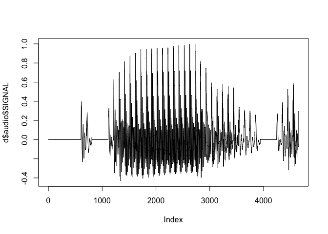
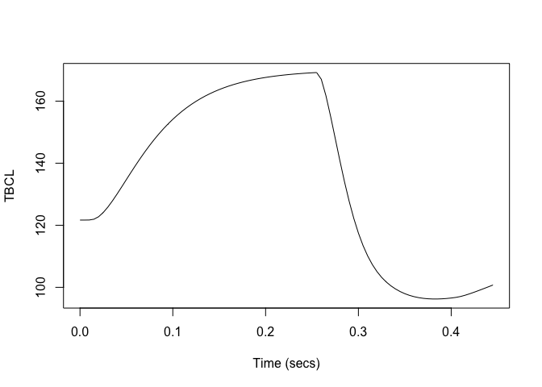
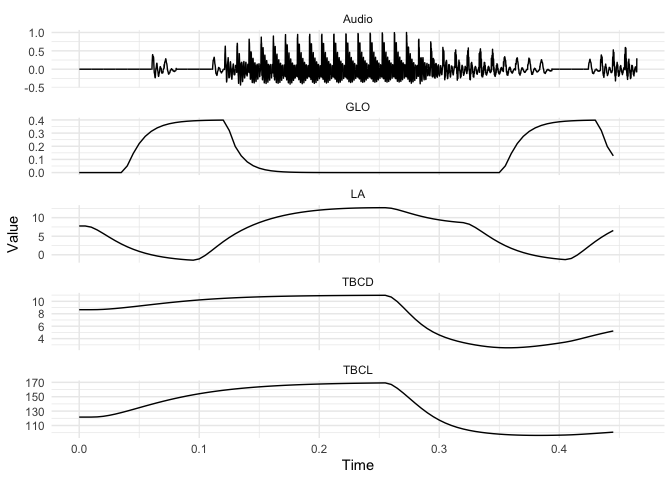

<!-- README.md is generated from README.Rmd. Please edit that file -->

# tadaR

<!-- badges: start -->
<!-- badges: end -->

The goal of tadaR is to provide R functions for processing and plotting
output from TADA (TAsk Dynamics Application). This involves operations
such as:

1.  Reading TADA Matlab output files
2.  Processing these files into a more R-friendly format
3.  Calculating derived variables, such as smoothing/filtering
    articualtor variables and calculating velocities.

## Preliminaries

The code works directly on the exported `.mat` MATLAB objects from TADA.
It requires the following packages to be installed.

``` r
library(tadaR)
library(tidyverse)
#> ── Attaching packages ─────────────────────────────────────── tidyverse 1.3.1 ──
#> ✓ ggplot2 3.3.5     ✓ purrr   0.3.4
#> ✓ tibble  3.1.3     ✓ dplyr   1.0.7
#> ✓ tidyr   1.1.3     ✓ stringr 1.4.0
#> ✓ readr   1.4.0     ✓ forcats 0.5.1
#> ── Conflicts ────────────────────────────────────────── tidyverse_conflicts() ──
#> x dplyr::filter() masks stats::filter()
#> x dplyr::lag()    masks stats::lag()
```

## Running TADA simulation from R

The function `run_tada` is a wrapper that calls Matlab from R, allows
command line input to Matlab, and allows you to specify the directory in
which Matlab operates (set via `target_dir`). In all cases,
`matlab_path` is the location of the Matlab application on your
computer. This is optional, as `run_tada` tries to find it
automatically, but if it fails to do so then you can specify it in
`matlab_path`.

Here are some examples of using `run_tada`.

The first example runs TADA’s `gest` function, which we specify using
the `tada_command` argument. `gest` takes orthographic or ARPABET input
and generates gestural and coupling specifications for the input and
saves two output files. The first argument of `gest()` is the output
filename and the second argument is the input string, which can be
orthographic or ARPABET (e.g. ‘KAE1T’). This will generate the files
`TVcat.O` and `PHcat.O` in `target_dir`.

``` r
run_tada(
  tada_command = "gest('cat' 'cat')"
  target_dir = "path/to/target/dir/",
  matlab_path = "/Applications/MATLAB_R2021a.app/bin/")
```

The next example runs simulations on a pre-existing TV/PH file pair,
such as the ones created by the above example. The below assumes that
the files `TVcat.O` and `PHcat.O` already exist in the `target_dir`. It
then runs the TADA simulation on them and saves all of the output files
to `target_dir`.

``` r
run_tada(
  tada_comand = "tada 'cat'",
  target_dir="path/to/target/dir/")
```

The following command does something similar to the previous one, but
instead of running the simulation on any files called ‘cat’, it runs the
simulations on all paired TV/PH.O files in `target_dir`. This is useful
if you have a large directory of TV/PH file pairs and is preferable to
running the previous command multiple times, as the below only calls
Matlab once, where the previous example starts/stops Matlab each time
the function is run.

``` r
run_tada(
  tada_comand = "tada 'all'",
  target_dir="path/to/target/dir/")
```

It is also possible to run `gest` and the `tada` simulations using a
single line of code. To do this you just the TADA syntax
`tada 'cat' 'cat'`, where the first argument is the output filename and
the second argument is the input string (which can be orthographic or
ARPABET). This is essentially equivalent to running the first two
examples given earlier, but in only a single function call.

``` r
run_tada(
  tada_comand = "tada 'cat' 'cat'",
  target_dir="path/to/target/dir/")
```

And just for completeness, here’s the same as above, but using ARPABET
input.

``` r
run_tada(
  tada_comand = "tada 'cat' '(KAE1T)'",
  target_dir="path/to/output/dir/")
```

Note that the ARPABET can also be a non-word. For example, if we wanted
to synthesise /ba.ba/ then we can do the following, using parentheses to
mark syllables.

``` r
run_tada(
  tada_comand = "tada 'baba' '(BAE1)(BAE1)'",
  target_dir="path/to/output/dir/")
```

Note that instead of using the above syntax in the `run_tada` commands,
you can use a convenience function `tada_stimulus` that will generate
this sequence for you given the input. E.g.

``` r
# returns "tada 'cat' 'cat'"
tada_stimulus("cat")
#> [1] "tada 'cat' 'cat'"
```

``` r
# returns "gest 'cat' 'cat'"
tada_stimulus("cat", gest=TRUE)
#> [1] "gest 'cat' 'cat'"
```

``` r
# returns "tada 'cat' '(KAE1T)'"
tada_stimulus("cat", "(KAE1T)")
#> [1] "tada 'cat' '(KAE1T)'"
```

Note that this always returns two arguments to tada or gest, so it’s not
suitable for when you want to evaluate a pair of pre-existing TV/PH
files (but a shortcut for that would be unnecessary anyway).

## Loading data and accessing variables

Load a TADA file using `read_tada` function. As an example, we use a
TADA synthesis of the word ‘pipe’, which is available as an example in
the `tadaR` package.

``` r
matfile <- system.file("extdata", "pipe_traj_mv.mat", package = "tadaR")

d <- read_tada(matfile)
```

Now we can plot columns as follows.

``` r
plot(d$audio$SIGNAL, type = "l") # plot audio signal
```



## Plotting signals and wide data

Generally, it’s much easier to use the data in an unnested form, with
one column for each variable.

``` r
d.wide <- unnest_tada(d)
```

The data object now looks like this:

``` r
head(d.wide)
#> # A tibble: 6 × 67
#>   Sample  Time   ULx   ULy   LLx   LLy  JAWx  JAWy   TTx   TTy   TFx   TFy   TDx
#>    <int> <dbl> <dbl> <dbl> <dbl> <dbl> <dbl> <dbl> <dbl> <dbl> <dbl> <dbl> <dbl>
#> 1      1 0      138.  130.  135.  122.  126.  121.  113.  117.  85.3  136.  70.8
#> 2      2 0.005  138.  130.  135.  122.  126.  121.  113.  117.  85.3  136.  70.8
#> 3      3 0.01   138.  130.  135.  122.  126.  121.  113.  117.  85.3  136.  70.8
#> 4      4 0.015  138.  130.  135.  122.  126.  121.  113.  117.  85.3  136.  70.7
#> 5      5 0.02   138.  130.  136.  123.  126.  121.  112.  117.  85.1  136.  70.6
#> 6      6 0.025  138.  130.  136.  124.  126.  121.  112.  117.  85.0  136.  70.4
#> # … with 54 more variables: TDy <dbl>, TRx <dbl>, TRy <dbl>, LX <dbl>,
#> #   JA <dbl>, CL <dbl>, CA <dbl>, GW <dbl>, TL <dbl>, TA <dbl>, F0a <dbl>,
#> #   PIa <dbl>, SPIa <dbl>, HX <dbl>, LX_vl <dbl>, JA_vl <dbl>, UY_vl <dbl>,
#> #   LY_vl <dbl>, CL_vl <dbl>, CA_vl <dbl>, NA_vl <dbl>, GW_vl <dbl>,
#> #   TL_vl <dbl>, TA_vl <dbl>, F0a_vl <dbl>, PIa_vl <dbl>, SPIa_vl <dbl>,
#> #   HX_vl <dbl>, PRO <dbl>, LA <dbl>, TBCL <dbl>, TBCD <dbl>, VEL <dbl>,
#> #   GLO <dbl>, TTCL <dbl>, TTCD <dbl>, TTCR <dbl>, F0 <dbl>, PI <dbl>, …
```

We can now refer directly to variables in order to plot the whole signal
file. The new object also has a `Time` column.

``` r
plot(d.wide$Time, d.wide$TBCL, type = "l", xlab = "Time (secs)", ylab = "TBCL")
```



## Smoothing articulatory variables and obtaining velocities

The `process_tada` function smooths the articulatory variables (such as
TT, TD, UL, LL, etc) using a Butterworth filter and then obtains
velocities for those variables. It also calculates tangential velocity
in the x/y plane for each variable. Note that the function only does
this for EMA-like articulatory variables, such as TT, TD, etc - it does
not process the tract variables (e.g. TBCD, TBCL) in this way, but I can
add that functionality if needed.

``` r
d.wide <- process_tada(d.wide)
```

## Long formant data

We can also convert the data to long format. This allows us to easily
show multiple variables on a single plot, which is very useful for
generating something that looks comparable to a gestural score.

First we can create a long data object.

``` r
d.long <- tidyr::gather(d.wide, "Variable", "Value", -Sample, -Time)
```

In order to get a long audio object, we use `getAudioLong` and add it to
the above object. This is necessary because the TADA audio object has a
different sampling rate from the articulatory channels.

``` r
d.long <- dplyr::bind_rows(d.long, getAudioLong(d))
```

The following code shows us which articulators/variables are available
to us in `d.long`.

``` r
unique(d.long$Variable)
#>   [1] "ULx"       "ULy"       "LLx"       "LLy"       "JAWx"      "JAWy"     
#>   [7] "TTx"       "TTy"       "TFx"       "TFy"       "TDx"       "TDy"      
#>  [13] "TRx"       "TRy"       "LX"        "JA"        "CL"        "CA"       
#>  [19] "GW"        "TL"        "TA"        "F0a"       "PIa"       "SPIa"     
#>  [25] "HX"        "LX_vl"     "JA_vl"     "UY_vl"     "LY_vl"     "CL_vl"    
#>  [31] "CA_vl"     "NA_vl"     "GW_vl"     "TL_vl"     "TA_vl"     "F0a_vl"   
#>  [37] "PIa_vl"    "SPIa_vl"   "HX_vl"     "PRO"       "LA"        "TBCL"     
#>  [43] "TBCD"      "VEL"       "GLO"       "TTCL"      "TTCD"      "TTCR"     
#>  [49] "F0"        "PI"        "SPI"       "TRt"       "gPRO"      "gLA"      
#>  [55] "gTBCL"     "gTBCD"     "gVEL"      "gGLO"      "gTTCL"     "gTTCD"    
#>  [61] "gTTCR"     "gF0"       "gPI"       "gSPI"      "gTR"       "TTx_filt" 
#>  [67] "TTy_filt"  "TFx_filt"  "TFy_filt"  "TDx_filt"  "TDy_filt"  "TRx_filt" 
#>  [73] "TRy_filt"  "ULx_filt"  "ULy_filt"  "LLx_filt"  "LLy_filt"  "JAWx_filt"
#>  [79] "JAWy_filt" "TTx_vel"   "TTy_vel"   "TFx_vel"   "TFy_vel"   "TDx_vel"  
#>  [85] "TDy_vel"   "TRx_vel"   "TRy_vel"   "ULx_vel"   "ULy_vel"   "LLx_vel"  
#>  [91] "LLy_vel"   "JAWx_vel"  "JAWy_vel"  "TT_tvel"   "TF_tvel"   "TD_tvel"  
#>  [97] "TR_tvel"   "UL_tvel"   "LL_tvel"   "JAW_tvel"  "Audio"
```

We can then plot selected variables over time using ggplot. The below
code plots the following: Audio, Lip Aperture (LA), TBCL, TBCD, Glottis
(GLO).

``` r
d.long %>% 
  dplyr::filter(Variable %in% c("Audio", "LA", "TBCL", "TBCD", "GLO")) %>% 
  ggplot() +
  aes(x = Time, y = Value) +
  geom_path() +
  facet_wrap(~Variable, ncol = 1, scales = "free_y") + # let *only* y-scaling be free
  theme_minimal()
```



## Further notes and future plans

Coming soon…

1.  Vignette showing a more comprehensive example for a typical
    workflow.

2.  Facility to convert TADA files to SSFF format for use with the EMU
    system: <https://github.com/IPS-LMU/emuR> This will allow for
    interactive viewing of gestural synthesis and use of EMU-webApp’s
    gestural annotation algorithms.

3.  More specific plotting functions for generating gestural scores.

4.  Force-alignment of TADA acoustic data to impose segmental boundaries
    on the gestural score (TADA itself is not segmental, as it
    synthesises output based on the overlapping gestures)

If you are interested in further articulatory-to-acoustic synthesis
using TADA data then HLSyn may also be helpful:
<https://github.com/samkirkham/hlsyn>
