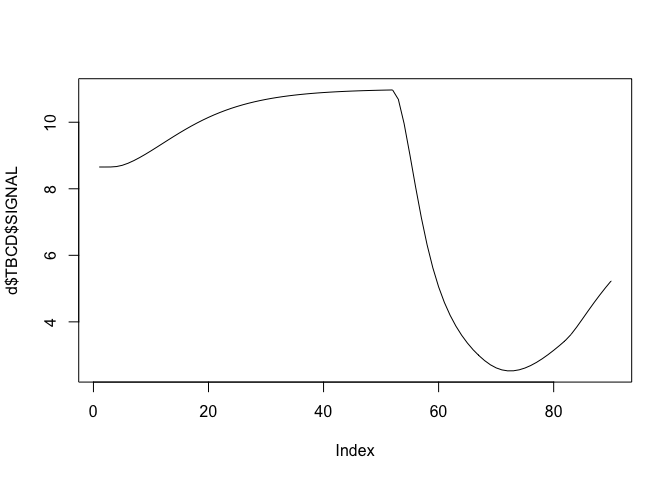
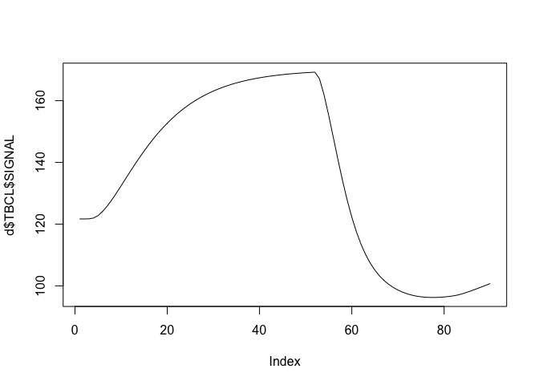
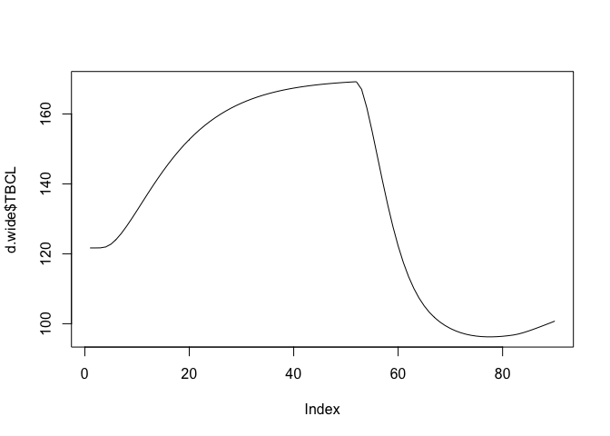
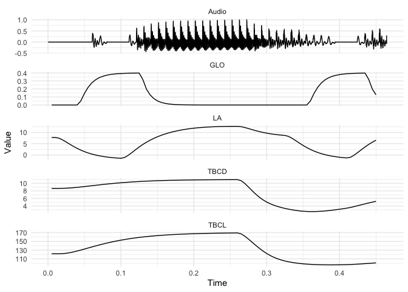

# tadaR

# R functions for processing and plotting output from TADA (TAsk Dynamics Application)

Sam Kirkham

### Preliminaries

The code works directly on the exported `.mat` MATLAB objects from TADA.
It requires the following packages to be installed.

``` r
library(R.matlab)
library(tidyverse)
```

You can load the tadaR functions as follows:

``` r
source("readTADA.R")
source("unnestTADA.R")
source("getAudioLong.R")
```

### Loading data and accessing variables

Load a TADA file using `readTADA` function. As an example, we use a TADA
synthesis of the word ‘pipe’.

``` r
d <- readTADA("pipe_traj_mv.mat")
```

Now we can plot columns as follows.

``` r
plot(d$audio$SIGNAL, type = "l") # plot audio signal
```


### Plotting signals and wide data

We can plot tract variable signals (across the whole file).

``` r
plot(d$TBCD$SIGNAL, type = "l") # TBCD
```



``` r
plot(d$TBCL$SIGNAL, type = "l") # TBCL
```



Generally though, it’s much easier to use the data in an unnested form,
with one column for each variable.

``` r
d.wide <- unnestTADA(d)
```

The data object now looks like this:

``` r
head(d.wide)
#> # A tibble: 6 x 60
#>   Sample  Time    UL    LL   JAW    TT    TF    TD    TR     LX    JA    CL
#>    <int> <dbl> <dbl> <dbl> <dbl> <dbl> <dbl> <dbl> <dbl>  <dbl> <dbl> <dbl>
#> 1      1 0.005  130.  122.  121.  117.  136.  130.  116. 0.0911  1.29 0.764
#> 2      2 0.01   130.  122.  121.  117.  136.  130.  116. 0.0911  1.29 0.764
#> 3      3 0.015  130.  122.  121.  117.  136.  130.  116. 0.0911  1.29 0.764
#> 4      4 0.02   130.  122.  121.  117.  136.  130.  116. 0.0911  1.29 0.764
#> 5      5 0.025  130.  123.  121.  117.  136.  130.  116. 0.0911  1.29 0.764
#> 6      6 0.03   130.  124.  121.  117.  136.  130.  115. 0.0911  1.29 0.763
#> # … with 48 more variables: CA <dbl>, GW <dbl>, TL <dbl>, TA <dbl>, F0a <dbl>,
#> #   PIa <dbl>, SPIa <dbl>, HX <dbl>, LX_vl <dbl>, JA_vl <dbl>, UY_vl <dbl>,
#> #   LY_vl <dbl>, CL_vl <dbl>, CA_vl <dbl>, NA_vl <dbl>, GW_vl <dbl>,
#> #   TL_vl <dbl>, TA_vl <dbl>, F0a_vl <dbl>, PIa_vl <dbl>, SPIa_vl <dbl>,
#> #   HX_vl <dbl>, PRO <dbl>, LA <dbl>, TBCL <dbl>, TBCD <dbl>, VEL <dbl>,
#> #   GLO <dbl>, TTCL <dbl>, TTCD <dbl>, TTCR <dbl>, F0 <dbl>, PI <dbl>,
#> #   SPI <dbl>, TRt <dbl>, gPRO <dbl>, gLA <dbl>, gTBCL <dbl>, gTBCD <dbl>,
#> #   gVEL <dbl>, gGLO <dbl>, gTTCL <dbl>, gTTCD <dbl>, gTTCR <dbl>, gF0 <dbl>,
#> #   gPI <dbl>, gSPI <dbl>, gTR <dbl>
```

The above plots are now much easier to do using the unnested data, as we
can refer directly to variables.

``` r
plot(d.wide$TBCL, type = "l") 
```



### Long formant data

We can also convert the data to long format. This allows us to easily
show multiple variables on a single plot, which is very useful for
generating something that looks comparable to a gestural score.

First we can create a long data object.

``` r
d.long <- tidyr::gather(d.wide, "Variable", "Value", -Sample, -Time)
d.long <- dplyr::bind_rows(d.long, getAudioLong(d))
```

The following code shows us which articulators/variables are available
to us.

``` r
unique(d.long$Variable)
#>  [1] "UL"      "LL"      "JAW"     "TT"      "TF"      "TD"      "TR"     
#>  [8] "LX"      "JA"      "CL"      "CA"      "GW"      "TL"      "TA"     
#> [15] "F0a"     "PIa"     "SPIa"    "HX"      "LX_vl"   "JA_vl"   "UY_vl"  
#> [22] "LY_vl"   "CL_vl"   "CA_vl"   "NA_vl"   "GW_vl"   "TL_vl"   "TA_vl"  
#> [29] "F0a_vl"  "PIa_vl"  "SPIa_vl" "HX_vl"   "PRO"     "LA"      "TBCL"   
#> [36] "TBCD"    "VEL"     "GLO"     "TTCL"    "TTCD"    "TTCR"    "F0"     
#> [43] "PI"      "SPI"     "TRt"     "gPRO"    "gLA"     "gTBCL"   "gTBCD"  
#> [50] "gVEL"    "gGLO"    "gTTCL"   "gTTCD"   "gTTCR"   "gF0"     "gPI"    
#> [57] "gSPI"    "gTR"     "Audio"
```

We can then plot selected variables over time using ggplot. The below
code plots the following: Audio, Lip Aperture (LA), TBCL, TBCD, Glottis
(GLO).

``` r
d.long %>% 
  dplyr::filter(Variable %in% c("Audio", "LA", "TBCL", "TBCD", "GLO")) %>% 
  ggplot2::ggplot(aes(x = Time, y = Value)) +
  geom_path() +
  facet_wrap(~Variable, ncol = 1, scales = "free_y") + # let *only* y-scaling be free
  theme_minimal()
```



### Further notes

It would be nice to have segmental boundaries. However, TADA is not
segmental, as it synthesises output based on overlapping gestures.
Instead, we would need to force-align the synthesised acoustic signal
and obtain temporal landmarks from the force-alignment.
